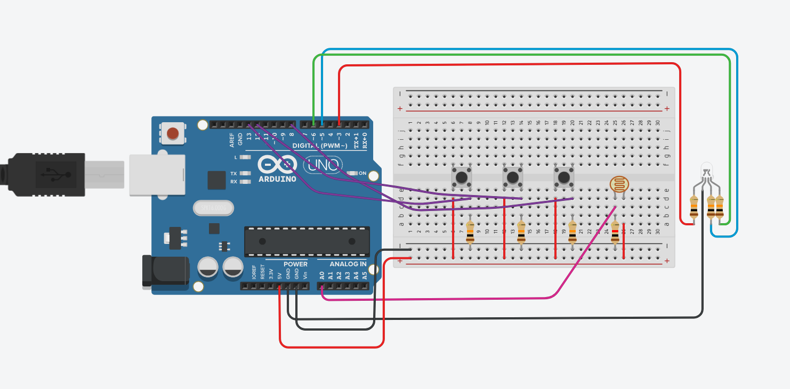
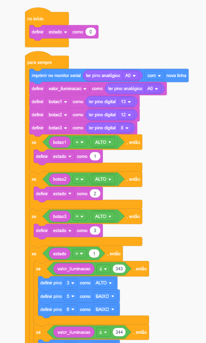
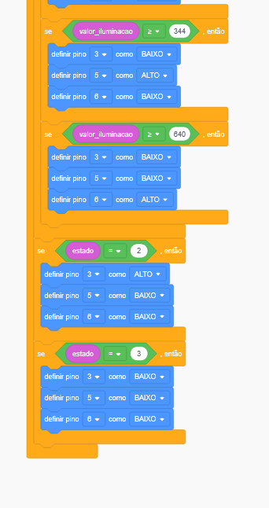
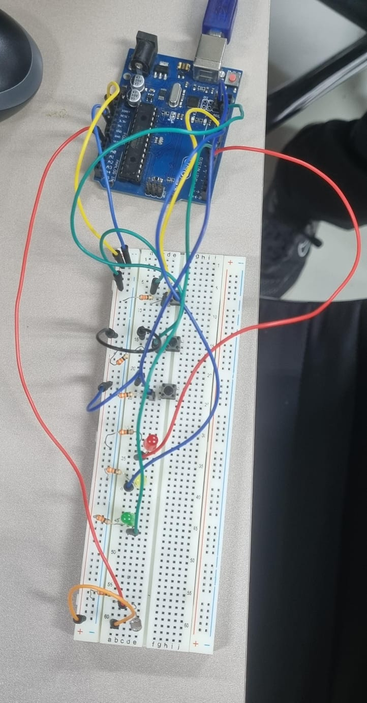
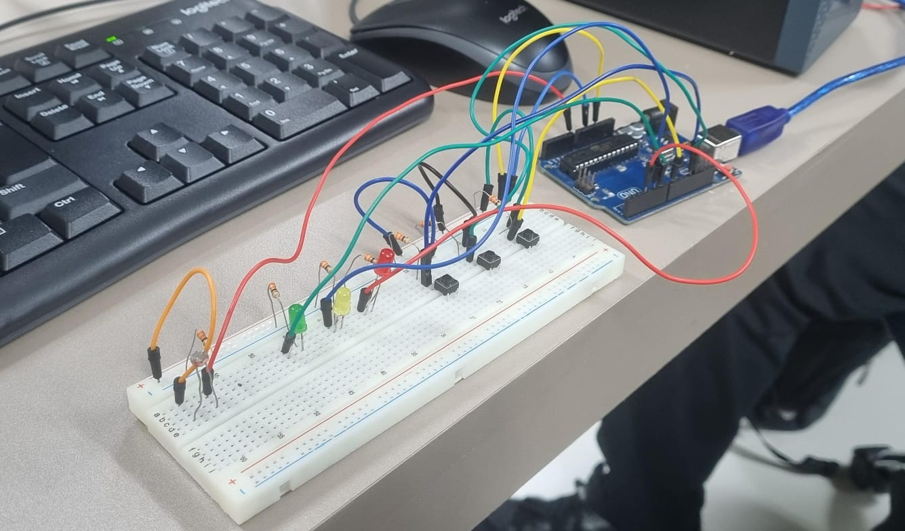

A3:
1) Identifique as entradas e saídas do sistema:
- Entradas:

  Fotorresistor : identifica se está claro, iluminação média ou escuro.

  Botão 1 : ao apertar, seleciona modo automático.

  Botão 2 : ao apertar, seleciona modo manual de alerta.

  Botão 3 : ao apertar, seleciona desligar o sistema.

- Saídas:

  LED RGB : exibe a cor de acordo com a iluminação ou exibe vermelho (se o botão 2 for pressionado)
  
    Verde : claro;
  
    Azul : médio;
  
    Vermelho : escuro ou modo alerta;


2) Apresente todos os componentes do sistema e para que eles servem:

    Fotorresistor(LDR): reage a luz, lendo se está claro, média iluminação ou escuro.
  
    Botões: mudam os estados ao serem pressionados.
  
    LED RGB: muda de cor, indicando a leitura do fotorresistor.
  
    Resistor: limita o fluxo de corrente elétrica, evitando problemas no arduíno.


3) Apresente as regras de funcionamento a serem implementadas:

    O modo padrão do sistema é o modo automático, que irá ler a iluminação do ambiente.
   
    Ao pressionar o botão 1, mudará para o modo automático; se já estiver nesse modo, irá permanecer.

    Ao pressionar o botão 2, mudará para o modo manual, exibindo luz vermelha e ignorando a leitura do LDR.

    Ao pressionar o botão 3, desligará o LED RGB, até que o usuário pressione outro botão.
   
    Como foi criada uma variável de controle, ao pressionar dois botões, apenas irá acender o último a ser pressionado. 


5) Explique como você utilizaria estruturas if para controlar o sistema:

   Se botao1 for pressionado: ativa modo autómatico de leitura; o LED RGB acende da cor correspondente à leitura do LDR.
   
   Se botao2 for pressionado: ativa modo manual, mantendo o LED na cor vermelha e ignorando a leitura do LDR.

   Se botao3 for pressionado: desliga o sistema, apagando o LED aceso.

   Uma variável de controle foi criada para que dois estados de botões apertados não possam existir ao mesmo tempo, ou seja, apenas o último a ser pressionado irá exibir o resultado.

Montagem do Circuito:

<p align="center">
  
</p>

Link do circuito no Tinkercad:
https://www.tinkercad.com/things/eRIlBwppFwY-bodacious-maimu?sharecode=IDMSs-jT8PTthkzG4sd3yMKRUkTxe60dOoC6uO6dJYw

Código em blocos:
<p align="center">
  
</p>
<p align="center">
  
</p>

Código em texto:

```bash
// C++ code
//
int valor_iluminacao = 0;

int botao1 = 0;

int botao2 = 0;

int botao3 = 0;

int estado = 0;

int flag = 0;

void setup()
{
  pinMode(A0, INPUT);
  Serial.begin(9600);
  pinMode(13, INPUT);
  pinMode(12, INPUT);
  pinMode(8, INPUT);
  pinMode(3, OUTPUT);
  pinMode(5, OUTPUT);
  pinMode(6, OUTPUT);

  estado = 0;
}

void loop()
{
  Serial.println(analogRead(A0));
  valor_iluminacao = analogRead(A0);
  botao1 = digitalRead(13);
  botao2 = digitalRead(12);
  botao3 = digitalRead(8);
  if (botao1 == HIGH) {
    estado = 1;
  }
  if (botao2 == HIGH) {
    estado = 2;
  }
  if (botao3 == HIGH) {
    estado = 3;
  }
  if (estado == 1) {
    if (valor_iluminacao <= 343) {
      digitalWrite(3, HIGH);
      digitalWrite(5, LOW);
      digitalWrite(6, LOW);
    }
    if (valor_iluminacao >= 344) {
      digitalWrite(3, LOW);
      digitalWrite(5, HIGH);
      digitalWrite(6, LOW);
    }
    if (valor_iluminacao >= 640) {
      digitalWrite(3, LOW);
      digitalWrite(5, LOW);
      digitalWrite(6, HIGH);
    }
  }
  if (estado == 2) {
    digitalWrite(3, HIGH);
    digitalWrite(5, LOW);
    digitalWrite(6, LOW);
  }
  if (estado == 3) {
    digitalWrite(3, LOW);
    digitalWrite(5, LOW);
    digitalWrite(6, LOW);
  }
  delay(10); // Delay a little bit to improve simulation performance
}
```
Fotos do circuito físico:
<p align="center">
  
</p>
<p align="center">
  
</p>
